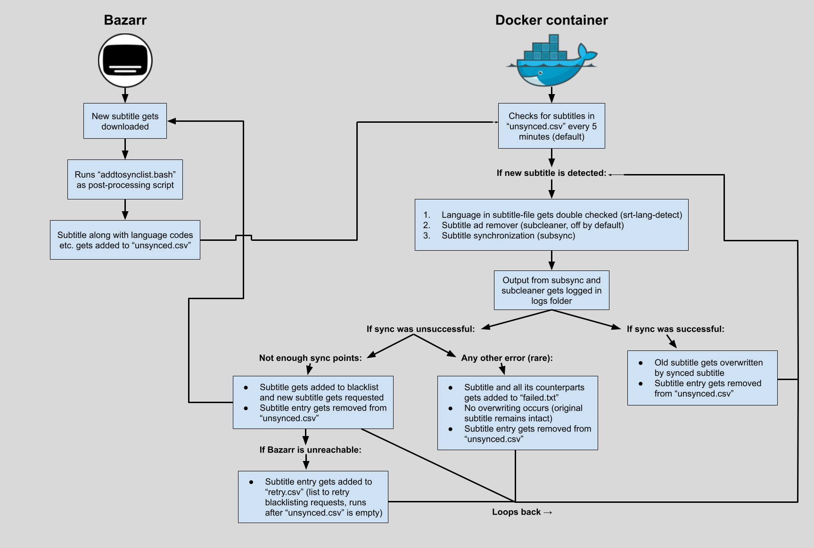

# subsyncerr

### Still in development and testing stage, using the project is _currently not_ recommended.

A containerized automated Bazarr-companion that synchronizes the subtitles downloaded by Bazarr using [sc0ty's subsync](https://github.com/sc0ty/subsync). Conditions are set in place for a successful sync that are quite strict, for in which case they aren't met, the subtitle will be blacklisted in Bazarr and a new subtitle will be downloaded. This will in turn leave you with close to 100% of your subtitles in sync.

This project could not have come into fruition without these amazing [open-source projects](#credits), written by awesome people.

## Features
* Great results for non-English subtitles, thanks to ``subsync's`` ability to sync them to already synced English subtitles, which evidently achieve better results.
* Simple concept, aimed to work as universally as possible, while also keeping the setup process easy to follow.
* Downloaded subtitles are saved as entries in a ``CSV``-file, enabling Bazarr to work independently from ``subsyncerr``.
* Separate ``CSV-file`` used for temporarily storing bad subtitles to blacklist while Bazarr-API is unreachable, ensuring that nothing gets swept under the rug.
* Blacklisting of bad unsyncable subtitles, leaving only successfully synced subtitles.
* Prerequisites for file permissions, Bazarr-API access, and other requirements before running ``main.py`` to ensure everything functions correctly.
* Logs are saved for both ``subsync`` and ``subcleaner``, making troubleshooting easier.
* Although uncommon, subtitles that can not be synchronized by ``subsync``, due to either a bad media file or an unsupported language saved in ``failed.txt``, which is a list for subtitles needing manual adjustment.
* [Language verification](https://github.com/mdcollins05/srt-lang-detect) on subtitles against language code in filename, in which case it detects another language, it will get blacklisted and a new subtitle will be requested. This has in my experience proven to be necessary.
* [Subtitle ad-remover](https://github.com/KBlixt/subcleaner) built-in, can be optionally enabled.

## Installation
1. Pull the container from the following Docker-repository: [tarzoq/subsyncerr](https://hub.docker.com/r/tarzoq/subsyncerr)
2. Create a new folder/share, allocate the folder to both Bazarr and the container using ``/subsyncerr`` as the container path.
3. Allocate the same media paths used by Bazarr to the container.
4. Add the following [Environment Variables](#environment-variables) along with their corresponding values: ``API_KEY`` & ``BAZARR_URL``
    * Additionally you can choose to enable subcleaner (KBlixt), by setting the environment variable value "SUBCLEANER" to "True". (Supported languages are: English, Spanish, Portuguese, Dutch, Indonesian and Swedish)
5. ``CPU-pinning`` for the container is highly recommended, subsync uses all it can get. (I for example have it set to one isolated core)
6. Check the container's Docker-log, if all prerequisite checks are passed, ``main.py`` will commence.
7. The container will now have added all necessary files, including the ``addtosynclist``-script to your newly created folder. Last step, simply add this as a post exectution script in Bazarr: 
    ````
    bash /subsyncerr/addtosynclist.bash '{{episode}}' '{{subtitles}}' '{{subtitles_language_code2}}' '{{subtitles_language_code3}}' '{{episode_language_code3}}' '{{subtitle_id}}' '{{provider}}' '{{series_id}}' '{{episode_id}}'
    ````
* One more thing, make sure Bazarr is using two-letter language codes in the filename (this is on by default). Hearing-impaired subtitles with ``hi``, ``cc`` or ``sdh`` in the filename will work fine. But if ``forced`` is added, it won't work, but those most likely won't work well with ``subsync`` either way.

### Docker-Compose
````
version: "3.8"
services:
  subsyncerr:
    image: tarzoq/subsyncerr:latest
    container_name: subsyncerr
    volumes:
      - /folder/path:/subsyncerr
      - /media/path:/container/path
    environment:
        API_KEY: None
        BAZARR_URL: http://localhost:6767
        SUBCLEANER: True # Optional, False by default
        TZ: Europe/Berlin
    cpuset: "5"
    restart: unless-stopped
````

## Environment Variables
| Variable | Required | Description | Default value |
| --- | --- | --- | --- |
| ``API_KEY`` | Yes | API key for Bazarr, required to blacklist and request new subtitles in case subtitles fail to synchronize. | ``None`` |
| ``BAZARR_URL`` | Yes | IP address/hostname and port for Bazarr. | ``http:localhost:6767`` |
| ``SUBCLEANER`` | No | True or False for if you want to enable ``subcleaner`` when processing subtitles. | ``False`` |
| ``SLEEP`` | No | Time interval for how often to check ``unsynced.csv`` for new entries when it is empty. | ``300 (seconds)`` |
| ``WINDOW_SIZE`` | No | Maximum window of time for ``subsync`` to spend synchronizing subtitles, lower this if you think subtitles take too long to finish (wouldn't recommend for most people). | ``1800 (seconds)`` |

## Usage
``Subsyncerr`` aims to be as self-reliant as possible. It's merely a companion, so subtitles are all still controlled as per usual through Bazarr. The only thing you need to be aware about is this projects approach to save ``subsync's`` "unprocessable" subtitles from being blacklisted, which is to add them to a list called ``failed.txt``.

### What To Do With Subtitles In ``failed.txt``
Whenever a subtitle gets added to ``failed.txt``, it's because the error outputted by ``subsync`` depicts that it couldn't process the media file properly. Based on my testing, if you look further down the page [``here``](#subsync), you can find the different triggers I have implemented.

How should I proceed? To put it simply, either get another media file, which can in many cases fare better, or, sync it manually. 

My approach is as follows:
1. Double-check to see if the subtitles are correct. 
    * In cases where the English subtitle is in sync, thus not requiring manual synchronization, the non-English subtitles can be easily re-downloaded in Bazarr, which will make them synchronize to the "in sync" English subtitle.
2. If you're out of luck, both the English subtitle is out-of-sync, and you can't get your hands on another media file, your only option left is unfortunately to sync it manually.
* Once done, remove it from ``failed.txt``. 

If you're curious, this project will always attempt to sync the English subtitle first, in which case it gets added to ``failed.txt``, all the non-English subtitles will first, if enabled, be processed by ``subcleaner``, and then they also get added to ``failed.txt``.

### Audio languages supported
``Subsync's`` only supported audio track languages are Chinese, Dutch, English, French, German, Italian, Russian and Spanish. Media files in any other language will most likely result in the subtitles being added to ``failed.txt``.

### Limitations
In some cases, the minimum point requirement is not enough to stop out-of-sync subtitles from getting through. Basically they still get high points above the threshold, just a good subtitle would. This is something caused directly by ``subsync``, which I have no ability to fix in the script. 

But in my experience it's most usually only out-of-sync in the beginning before an intro in a TV Show, or one small segment of the subtitle.

## How It Works
When processing a non-English subtitle, it will first look in ``unsynced.csv`` for an English counterpart. If that is found, that is processed first. If it doesn't exist in ``unsynced.csv`` but does as a file, it will assume it has already been processed and sync to that subtitle file. If neither of those are true, it will sync the non-English subtitle directly to the audio, just like an English subtitle. 

The reason for this is my testing, I arrived at the conclusion that syncing the non-English subtitle directly to the audio yields much worse results than my approach. For this very reason the script will redownload all non-English subtitles when a new English subtitle has been processed, to make sure everything stays consistent. An example of this would be if Bazarr upgrades to a better English subtitle on a new movie.

### Flowchart
 The process depicted in this flowchart is simplified to demonstrate the fundamentals required to understand how everything works together.

### Files
| File | Description |
| --- | --- |
| ``addtosynclist.bash``| Script used by Bazarr to add downloaded subtitles to ``unsynced.csv``. |
| ``failed.txt`` | List of subtitles which couldn't be processed by ``subsync``. |
| ``main.py`` | Main script which processes subtitles found in ``unsynced.csv``. |
| ``retry.csv`` | List of subtitles that are waiting be blacklisted while Bazarr-API is unreachable (located in the ``logs`` directory). |
| ``start.py`` | Script which checks all prerequisites, and if met will launch ``main.py``. |
| ``unsynced.csv`` | List of subtitles-entries which are yet to be processed. |

### Folder structure
```
/subsyncerr
├── addtosynclist.bash
├── failed.txt
├── unsynced.csv
└── /logs
    ├── retry.csv
    ├── /subcleaner # Only exists if enabled
    └── /subsync
```

### Operating System Support
As of this moment only Linux has been verified to work, the code includes different Linux file operation commands which most likely don't work on Windows. If enough people request it, the code could be modified in those places to implement a check for which operating system is in use, and from there select the appropriate operation command for the system.

I personally am running this on Unraid, with Linuxserver's Docker version of Bazarr.

## What Motivated Me To Do This
It all started when I started using Plex along with the *arrs, but more specifically, Bazarr. It was not an unusual occurrence for me to sit down to watch something, only for the subtitles to be completely out-of-sync. With other people using my server, I quickly recognized the significance to this issue, and if you're anything like me, you'd rather have no subtitles than subtitles that are so out-of-sync they need to be manually disabled. The feeling of unreliability when pressing play, anxiously hoping the subtitle would be in sync, fueled my frustration, forcing me to set out for a solution.

My first quest started by dabbling with Bazarr and its built-in sync feature (``ffsubsync``). At first I felt hope, as it seemed to work quite well on the few subtitles I tested, thinking I had found the solution. However, as someone with English as their second-language, it quickly revealed that even though English subtitles seemed to achieve better results, the same couldn't be said for non-English subtitles.

This expanded my search to all corners of Reddit, GitHub and Google. On Reddit, I found a concept by a user called [``pasm99``](https://www.reddit.com/r/bazarr/comments/106sbub/comment/juszb2v/?utm_source=share&utm_medium=web3x&utm_name=web3xcss&utm_term=1&utm_content=share_button), which was a post execution script that added the downloaded subtitle to a list, which was then checked ever so often by a cronjob, and if a subtitle was found, it would be processed by ``subsync``. On GitHub I found a project by ``drikqlis`` called [``SubSyncStarter``](https://github.com/drikqlis/SubSyncStarter). This project included the interesting approach of blacklisting the subtitle in case the sync failed. However, one of the biggest downsides to both of these, and what eventually led me to start this project, is they let through too many false positive syncs.

### Subaligner
Due to this negative experience I first had with ``subsync``, I continued seeking other subtitle synchronizers, where a few of those tested were: [``alass``](https://github.com/kaegi/alass), [``autosubsync``](https://github.com/oseiskar/autosubsync) and [``subaligner``](https://github.com/baxtree/subaligner). During my testing I discovered that [``subaligner``](https://github.com/baxtree/subaligner) by ``baxtree`` seemed to quite reliably detect when it didn't produce a good sync result. For that reason, this project started out and was at first called "``subaligner-bazarr``", where ``subaligner`` synced the English subtitles to the audio, and ``subsync`` was used to sync the non-English subtitles to the synced English subtitle. Sadly, after approximately 1 month of use I noticed a subtle pattern, stemming from ``subaligner``, where small segments of otherwise synced subtiles would be completely out-of-sync. This is in no way intended to condescend ``subaligner``, in fact I'm still keeping an eye on it's development for potential improvements. Anyhow, due to this, I went back to the more popular ``subsync``, attempting to understand its quirks.

### Subsync
As it turned out, ``subsync`` had a lot of potential. What this project does differently from everything else I've witnessed is that through lots of extensive testing, I have figured out what the different outputted errors from ``subsync`` mean, and how to use them to apply the most appropriate action accordingly. Through trial and error I also figured out ``subsync's`` perfect threshold for the minimum number of points required, based on the length of the media file being processed, which basically means that ``subsync`` needs to reach above a set score to count as a successful sync. In my testing with ``subsync`` one of three things can happen, here are the results along with their triggers:
1. Successful sync.
    * Subtitle reaches above the ``min-points-no``, and no error is given.
2. Add to blacklist and new subtitle requested.
    * Subtitle gets a lower score than required, which returns an error  (couldn't synchronize!).
3. Subtitle added to ``failed.txt``, requiring manual intervention.
    * Subtitle acquires a very low score of 0, which is caused by an unsyncable media file, meaning no subtitle file will ever return successful.
    * Recognition model for requested language is not available for ``subsync``.
    * Subtitle has failed 3 or more times with the error "couldn't synchronize!" in logs.
    * Subsync exceeds its ``WINDOW_SIZE`` multiplied by 2.5, anything above this threshold showed no success in my testing.
    * Unknown error, fail-safe for not yet encountered errors.

### Project Name
Like I mentioned earlier, this project was at first called _subaligner-bazarr_, which after its eventual switch over to ``subsync`` turned into _subsync-bazarr_. While writing this README-file, preparing to release it to the world, I had the excellent idea to name it ``subsyncarr``. Before proceeding I felt I had to make really make sure it was available, and to my surprise a project by that name had was already available. Out of respect for their project, I decided to name this project ``subsyncerr`` instead.

### Closing Thoughts
What I envisioned to be the ultimate way of viewing subtitles in Plex was a lot like a streaming service, to not have to worry about them, just letting Plex auto-select your preferred language, and for them to be synchronized. With this project I can proudly say that I believe I have finally arrived at the best current solution to this problem, and now all I want is for the rest of you in the community to get a piece of the pie. Thank you for taking interest in reading my journey to a worry free viewing experience, enjoy!

## Future Feature Ideas:
* Add a stopwatch right next to the "Processed, Remaining" row, which stops when the current process finishes, giving the user a good overview of how much time each processed subtitle has taken.
* Create a small webserver or have the ability to output the Docker-log, along with subtitles in ``unsynced.csv`` and ``failed.txt`` on a website, to be easily used in apps like NZB360 to view current status.
* Add notification module for when a subtitle gets added to failed.txt

## Inspirations
* [``SubSyncStarter``](https://github.com/drikqlis/SubSyncStarter) by ``drikqlis``, inspired the idea to utlize Bazarr's API to blacklist subtitles that receive an error in ``subsync``.
* [``Concept``](https://www.reddit.com/r/bazarr/comments/106sbub/comment/juszb2v/?utm_source=share&utm_medium=web3x&utm_name=web3xcss&utm_term=1&utm_content=share_button) by Reddit-user: ``pasm99``, displayed a simple but effective method of storing Bazarr's downloaded subtitles in a list inside of a file, this way Bazarr and the container can work independently without any downloaded subtitles being be missed.

## Credits
Written with a little help from Claude 3.5-Sonnet, one of the best coding AIs in the world at this time. The Al has only been used as a tool, as it hasn't been able to reliably change code without supervision.

* [subsync (sc0ty)](https://github.com/sc0ty/subsync), for synchronizing the subtitles to both audio and other subtitles.
* [subcleaner (KBlixt)](https://github.com/KBlixt/subcleaner), for removing advertisements in subtitles.
* [srt-lang-detect (mdcollins05)](https://github.com/mdcollins05/srt-lang-detect), for verifying language in subtitle to language code in the filename.